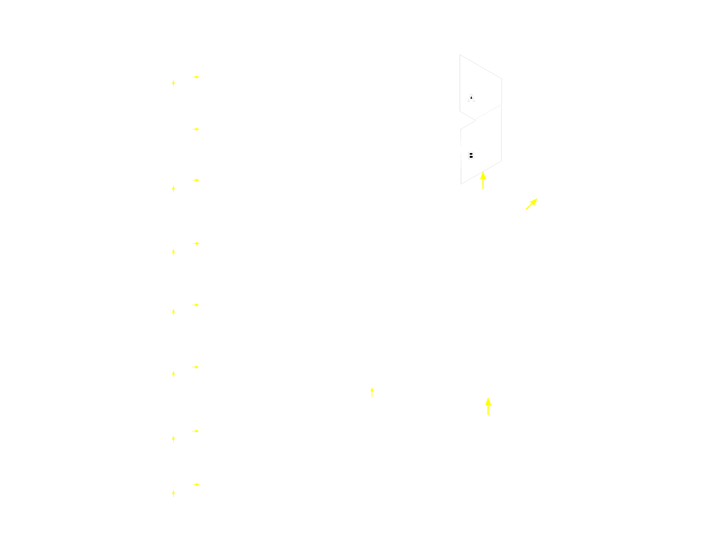
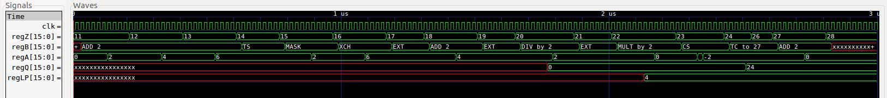

# Our Functional AGC

Our Block 1 simulation program successfully runs a test program that is pre-loaded into its memory, similar to programs on the actual AGC, which were loaded into memory to be accessed by the operator at different points in the flight. We aimed to test all of our functionalities in this test. As such we Add, subtract, multiply, divide, transfer control(similar to jump register), mask(and), extend, clear and subtract(invert), store word(TS), and exchange a word from memory(CS). Each of these functionalities were shown to work.  

## Our Overall System  
We designed our system to have two main subcomponents, the ALU and the Memory modules. The registers are represented in the block diagram below with MUX's going to them. In actuality in the original AGCs, the registers were actually folded into the memory and were accessible through similar muxes to the way we have considered them but were also addressable memory words. Although not depicted in this block diagram, largely for readability, we have incorporated this functionality by porting each of the 8 flip-flop registers into and out of memory such that one can pull the value of register LP or A and such by accessing mem(reg_address). The register addresses are as follows:

| Register | Memory Address |
| :------: | :----------: |
| regZ     |      0       |
| regX     |      1       |
| regY     |      2       |
| regA     |      3       |
| regB     |      4       |
| regQ     |      5       |
| regG     |      6       |
| regLP    |      8       |
| 16'd1    |      9       |
| 16'd2    |     10       |

The other portion of our system not fully illustrated in our block diagram is our control pulses, finite state machine. In our block diagram, yellow arrows indicate the control signals. These control signals discussed more in the Instructions and FSM page, control all of the subroutines of each operation enabling the write capabilities of registers and memory, controlling the MUX selections, and driving the operation of the ALU.  

  

## Our Test Program

The program loaded into the memory is as follows where OP is our op-code, QC is our quarter-code, ADDRESS is the address portion of our command, P is our parity bit, and OPERATION is the translated op code and address in a readable format:

| OP | QC  | ADDRESS | P | OPERATION |
| :--: | :--: | :---:| :--: | :--: |
| 110 | 00 | 0000001010 | 1 | ADD(regA, mem(d10)) |
| 110 | 00 | 0000001010 | 1 | ADD(regA, mem(d10)) |
| 110 | 00 | 0000001010 | 1 | ADD(regA, mem(d10)) |
| 101 | 10 | 0001100100 | 1 | TS(d100) |
| 111 | 00 | 0000001010 | 0 | MASK(regA,mem(d10)) |
| 101 | 11 | 0001100100 | 0 | XCH(d100) |
| 101 | 01 | 0000000000 | 0 | EXTEND |
| 110 | 00 | 0000001010 | 1 | SUB(regA, mem(d10)) |
| 101 | 01 | 0000000000 | 0 | EXTEND |
| 001 | 00 | 0000001010 | 1 | DIV(regA,mem(d10)) |
| 101 | 01 | 0000000000 | 0 | EXTEND |
| 111 | 00 | 0000001010 | 1 | MULT(regA,mem(d10)) |
| 100 | 00 | 0000001010 | 1 | CS(mem(d10)) |
| 000 | 00 | 0000011010 | 0 | TC(d27) |
| 000 | 00 | 0000000000 | 0 | no_op |
| 000 | 00 | 0000000000 | 0 | no_op |
| 110 | 00 | 0000001010 | 1 | ADD(regA, mem(d10)) |

It should be noted that the subtract appears in GTKwave as an ADD as it is the same command as ADD, but the preceding extend command indicates the command is subtract. In addition, the no-ops should never be executed as the TC should skip to the last ADD command.

## Our AGC in Action  
The following image shows the GTKwave trace of the program counter (regZ), instructions (regB), the accumulator (regA), the quotient/return register (regQ), and the lower product used in multiplication (regLP). The program counter increments by 1 through until it hits the transfer control command at which point it jumps to the stated address.  

  

Our expected results compared to our actual results are shown as follows:

| EXPECTED RESULT | | | | | ACTUAL RESULT | | | | |

|regZ | regB | regA | regLP | regQ | regZ | regB | regA | regLP | regQ | PASS: |
| :-: | :--: | :--: | :---: | :--: | :--: | :--: | :--: | :---: | :--: | :---: |
| 11  |  AD  |  2   |   X   |  X   |  11  |  AD  |  2   |   X   |  X   |   Y   |
| 12  |  AD  |  4   |   X   |  X   |  12  |  AD  |  4   |   X   |  X   |   Y   |
| 13  |  AD  |  6   |   X   |  X   |  13  |  AD  |  6   |   X   |  X   |   Y   |
| 14  |  TS  |  6   |   X   |  X   |  14  |  TS  |  6   |   X   |  X   |   Y   |
| 15  |  MSK |  2   |   X   |  X   |  15  |  MSK |  2   |   X   |  X   |   Y   |
| 16  |  XCH |  6   |   X   |  X   |  16  |  XCH |  6   |   X   |  X   |   Y   |
| 17  |  EXT |  6   |   X   |  X   |  17  |  EXT |  6   |   X   |  X   |   Y   |
| 18  |  SUB |  4   |   X   |  X   |  18  |  SUB |  4   |   X   |  X   |   Y   |
| 19  |  EXT |  4   |   X   |  X   |  19  |  EXT |  4   |   X   |  X   |   Y   |
| 20  |  DIV |  2   |   X   |  0   |  20  |  DIV |  2   |   X   |  0   |   Y   |
| 21  |  EXT |  2   |   X   |  0   |  21  |  EXT |  2   |   X   |  0   |   Y   |
| 22  |  MP  |  0   |   4   |  0   |  22  |  MP  |  0   |   4   |  0   |   Y   |
| 23  |  CS  | -2   |   4   |  0   |  23  |  CS  | -2   |   4   |  0   |   Y   |
| 24  |  TC  | -2   |   4   | 24   |  24  |  TC  | -2   |   4   | 24   |   Y   |
| 27  |  AD  |  0   |   4   | 24   |  27  |  AD  |  0   |   4   | 24   |   Y   |

Overall: **PASS**  
